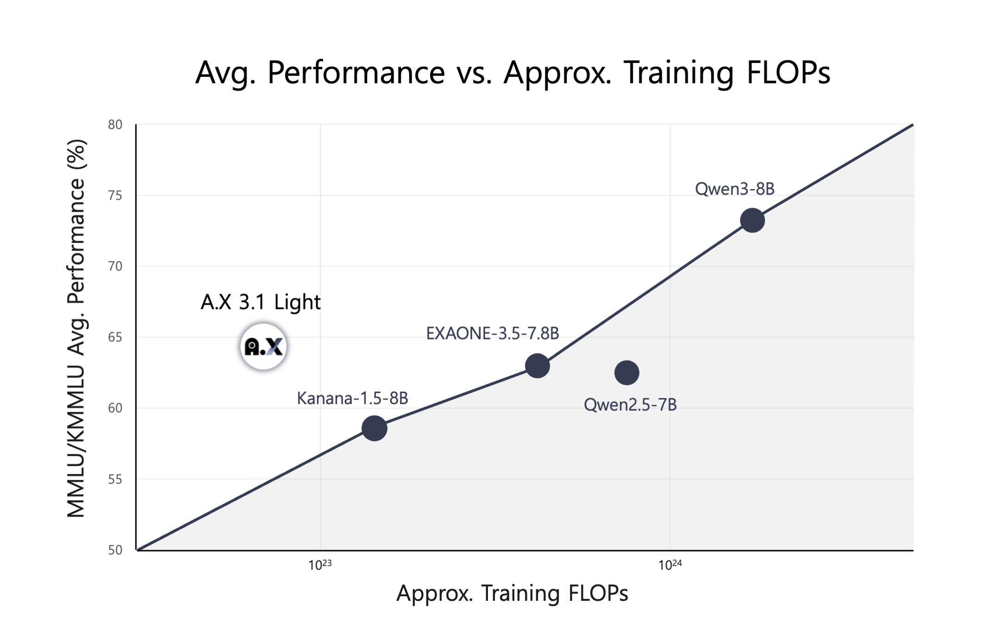

  

 

  <a href="https://huggingface.co/collections/skt/ax-3-686b288b3b05e1234f3f4c73">🤗 Models</a> |
  <a href="https://sktax.chat/chat">💬 Chat</a> |
  <a href="https://github.com/SKT-AI/A.X-3">🖥️ Github</a>

# A.X 3.1: 한국어 특화 대규모 언어 모델

[**🇺🇸 View English README**](README.en.md)

SK텔레콤이 독자적으로 개발한 대규모 언어 모델(LLM) **A.X 3.1** (에이닷엑스 3.1)을 2025년 7월 11일 출시했습니다. 자체 클러스터를 활용해 모델 구조 설계부터 데이터 수집, 학습까지 전 과정을 자체적으로 수행하여 완전한 통제력을 가진 **한국 소버린 AI** 모델로, **총 1조 6,500억 토큰** 규모의 다국어 코퍼스를 기반으로 **처음부터(from scratch)** 학습되었습니다. 이 중 한국어는 핵심 언어로 포함되어 있으며, 고품질 데이터에 집중하여 **학습량 대비 가장 효율적인** 성능을 보여주는 **한국형 LLM**입니다.

## A.X 3.1, 무엇이 다른가요?

- **완전한 한국 소버린 AI**: A.X 3.1은 SKT의 자체 인프라 TITAN 클러스터에서 학습되었습니다. 모델 학습에 사용된 데이터는 20조 토큰에 달하는 웹 기반 대규모 코퍼스를 기반으로 하며, 이는 SKT 내부 파이프라인으로 직접 수집/정제/가공되었습니다.
- **고효율 다중언어 LLM**: A.X 3.1 Light은 1조 6,500억 토큰이라는 가장 적은 학습량으로 훈련된 한국어 오픈소스 LLM 가운데 가장 컴퓨팅 효율적인 모델입니다.
- **뛰어난 한국어 실력**: 대표적인 한국어 지식 평가 벤치마크인 [KMMLU](https://huggingface.co/datasets/HAERAE-HUB/KMMLU)에서 61.7점을 기록하여, 다른 한국어 특화 모델 대비 우수한 성능을 보였습니다.
- **고도화된 언어 이해 능력**: 고난도 한국어 언어 역량 평가 벤치마크인 [KoBALT-700](https://huggingface.co/datasets/snunlp/KoBALT-700)에서 27.43점을 기록하며, 한국어 특화 모델 중 가장 높은 성능을 입증했습니다.
- **효율적인 토큰 처리**: 동일한 한국어 텍스트를 입력해도 A.X 3.1보다 GPT-4o가 약 1.5배 많은 토큰을 사용합니다.
- **배포 옵션**: 340억 개(34B) 매개변수를 갖춘 표준 모델 A.X 3.1과 70억 개(7B) 매개변수의 경량 모델 A.X 3.1 Light로 제공되며, 기업 내부 서버에 직접 설치(온프레미스)할 수 있어 데이터 보안에 대한 걱정을 덜 수 있습니다.
- **방대한 정보 처리**: A.X 3.1은 최대 32,768 토큰 길이의 문서나 대화를 한 번에 이해할 수 있습니다.

## 핵심 기술은?

A.X 3.1은 오픈소스 기반이 아닌, 완전히 처음부터(Scratch) 독립적으로 설계 및 학습된 SKT의 **소버린 LLM**입니다. 아키텍처 설계, 학습 데이터, 인프라, 최적화 전략까지 전 과정을 SKT가 직접 구축하였습니다.

### 모델 아키텍처 스펙

A.X 3.1 시리즈는 파라미터 수 대비 최적화된 구조로 설계되어 연산 효율성과 확장성을 확보했습니다.

| Model         | # Params | # Layers | # KV-Heads | Hidden Dim | FFN Dim |
|:--------------|---------:|---------:|-----------:|-----------:|--------:|
| A.X 3.1 Light | 7B       | 32       | 32         | 4096       | 10880   |
| A.X 3.1       | 34B      | 48       | 8          | 8192       | 21824   |

### Pareto-Optimal 연산 효율성

A.X 3.1은 동급 성능의 모델들보다 5~6배 낮은 연산량으로 학습되었습니다.

  

### 고품질 데이터 정제 파이프라인과 데이터 믹스처

- 모델 학습을 위해 20조 토큰에 달하는 웹 기반 대규모 코퍼스를 구축하였습니다.
- 이 데이터는 SKT 내부 파이프라인으로 직접 수집·정제·가공되었으며, 데이터 합성 및 정교한 필터링 과정을 통해 고품질(high-quality) 문서를 선별했습니다.
- A.X 3.1의 학습에 활용된 최종 토큰 수는 1.65조(1.65 trillion)개로, 한국어를 중심으로 언어와 도메인 비중을 균형있게 반영한 전략적 데이터 믹스처로 구성되었습니다.

### 클라우드에 의존하지 않은 완전 독립 인프라

- A.X 모델 시리즈는 모두 외부 클라우드 서비스에 의존하지 않고, SK텔레콤이 직접 구축한 고성능 AI 클러스터에서 학습되었습니다.
- 이는 비용 최적화 뿐 아니라 데이터 보안성과 연산 자원의 독립성 확보 측면에서 중요한 의미를 가집니다.

## 벤치마크 측정 결과

- A.X 3.1 Light는 동급 모델들 대비 MATH(70.14), HumanEval+ (73.78), MBPP+ (61.64) 등 코딩과 논리적 추론이 필요한 벤치마크에서 강세를 보입니다.
- 특히 KMMLU (61.7), KoBALT (27.43), Ko-IFEval (70.04) 등 한국어 평가 지표에서 타사 모델 대비 우세하여 균형 잡힌 한국어 처리 능력을 갖췄습니다.

<table>
  <thead>
    <tr>
      <th colspan="2">Benchmarks</th>
      <th>A.X 3.1 Light</th>
      <th>Kanana-1.5-8B</th>
      <th>EXAONE-3.5-7.8B</th>
      <th>Qwen2.5-7B</th>
      <th>Qwen3-8B (w/o reasoning)</th>
    </tr>
  </thead>
  <tbody>
    <tr>
      <td rowspan="4">Knowledge</td>
      <td>KMMLU</td>
      <td>61.70</td>
      <td>48.28</td>
      <td>53.76</td>
      <td>49.56</td>
      <td>63.53</td>
    </tr>
    <tr>
      <td>CLIcK</td>
      <td>71.22</td>
      <td>61.30</td>
      <td>64.11</td>
      <td>58.30</td>
      <td>63.31</td>
    </tr>
    <tr>
      <td>KoBALT</td>
      <td>27.43</td>
      <td>23.14</td>
      <td>21.71</td>
      <td>21.57</td>
      <td>26.57</td>
    </tr>
    <tr>
      <td>MMLU</td>
      <td>66.95</td>
      <td>68.82</td>
      <td>72.20</td>
      <td>75.40</td>
      <td>82.89</td>
    </tr>
    <tr>
      <td rowspan="2">General</td>
      <td>Ko-MT-Bench</td>
      <td>78.56</td>
      <td>76.30</td>
      <td>81.06</td>
      <td>61.31</td>
      <td>64.06</td>
    </tr>
    <tr>
      <td>MT-Bench</td>
      <td>74.38</td>
      <td>77.60</td>
      <td>83.50</td>
      <td>79.37</td>
      <td>65.69</td>
    </tr>
    <tr>
      <td rowspan="2">Instruction Following</td>
      <td>Ko-IFEval</td>
      <td>70.04</td>
      <td>69.96</td>
      <td>65.01</td>
      <td>60.73</td>
      <td>73.39</td>
    </tr>
    <tr>
      <td>IFEval</td>
      <td>79.86</td>
      <td>80.11</td>
      <td>82.61</td>
      <td>76.73</td>
      <td>85.38</td>
    </tr>
    <tr>
      <td rowspan="2">Math</td>
      <td>HRM8K</td>
      <td>41.70</td>
      <td>30.87</td>
      <td>31.88</td>
      <td>35.13</td>
      <td>52.50</td>
    </tr>
    <tr>
      <td>MATH</td>
      <td>70.14</td>
      <td>59.28</td>
      <td>63.20</td>
      <td>65.58</td>
      <td>71.48</td>
    </tr>
    <tr>
      <td rowspan="2">Code</td>
      <td>HumanEval+</td>
      <td>73.78</td>
      <td>76.83</td>
      <td>76.83</td>
      <td>74.39</td>
      <td>77.44</td>
    </tr>
    <tr>
      <td>MBPP+</td>
      <td>61.64</td>
      <td>67.99</td>
      <td>64.29</td>
      <td>68.50</td>
      <td>62.17</td>
    </tr>
  </tbody>
</table>

더 자세한 정보가 필요하시거나 궁금한 점이 있으시면 아래 연락처로 편하게 문의해 주세요.

**연락처**: [a.x@sk.com](mailto:a.x@sk.com)
